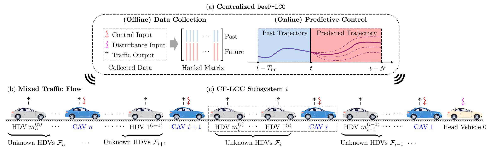

# Distributed-DeeP-LCC
In this project, we present Distributed DeeP-LCC (Data-EnablEd Predictive Leading Cruise Control) algorithm for CAV cooperation in large-scale mixed traffic flow.

## Centralized DeeP-LCC
DeeP-LCC is a centralized data-driven predictive control strategy for CAVs in mixed traffic, where human-driven vehicles (HDVs) also exist. It collects the measurable data from the entire mixed traffic system, and relies on Willems' Fundamental Lemma for behavior representation and predictive control. See Project [DeeP-LCC](https://github.com/soc-ucsd/DeeP-LCC) for details.

## Cooperative DeeP-LCC

Cooperative DeeP-LCC naturally partitions the mixed traffic system into multiple CF-LCC (Car-Following LCC) subsystems, with one leading CAV and multiple HDVs following behind (if they exist). Each CAV directly utilizes measurable traffic data from its own CF-LCC subsystem to design safe and optimal control behaviors. The interaction between neighbouring subsystems is formulated as a coupling constraint.

The optimization problem is as follows.

## Algorithm: Distributed DeeP-LCC
A tailored ADMM based distributed implementation algorithm (distributed DeeP-LCC) is designed to solve the cooperative DeeP-LCC formulation.

The benefits of our algorithm include:
- Computation efficiency
- Communication efficiency
- Local data privacy

## Related projects
1. [DeeP-LCC](https://github.com/soc-ucsd/DeeP-LCC)
2. [Leading Cruise Control (LCC)](https://github.com/soc-ucsd/LCC)
3. [Mixed-traffic](https://github.com/soc-ucsd/mixed-traffic)

## Contact us
To contact us about Deep-LCC, email [Jiawei Wang](mailto:wang-jw18@mails.tsinghua.edu.cn?Subject=Distributed-DeeP-LCC).

